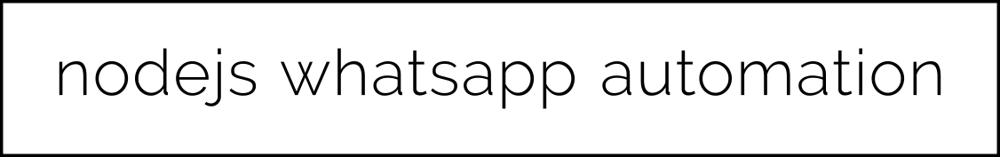

<p align="center">
  
</p>

<br/><br/>

### 1 - RUNNING THIS APP? EEzzz ..
---
because it is docker based, make sure you have installed **docker** and **docker-compose**.
and the rest, please follow the steps below.

- Clone this repo
```sh
> git clone https://github.com/berrabe/nodejs-whatsapp-automation.git
> cd nodejs-whatsapp-automation
```

- a little configuration you have to do, all these values are default, change according to your needs. replace it in a file called **docker-compose.yml**
```sh
# this is default config for whatsapp-bot container
- DATABASE_HOST=mariaDB
- DATABASE_USER=root
- DATABASE_PASSWORD=berrabe
- DATABASE_NAME=whatsapp_berrabe
- SERVER_URL=localhost
- SERVER_PORT=8000

# this is default config for whatsapp-db container
- MYSQL_ROOT_PASSWORD=berrabe
- WHATSAPP_DB_NAME=whatsapp_berrabe
```

- and it's time to run this application
```sh
# run the stack
> docker-compose up -d

# to get a qr code in the terminal, you have to run this command, then scan the qr code in the whatsapp smartphone app
> docker-compose logs -f
```

<br/><br/>

### 2 - INSTALL THE PHP FRAMEWORK
---
- <b>LARAVEL 8</b>

if you want to install laravel 8, you can install it with composer by checking the official laravel documentation here https://laravel.com/docs/8.x/installation. 
Or you can see the steps below

```sh
> docker exec dockerphpframework_php_1 composer global require laravel/installer
> docker exec dockerphpframework_php_1 composer create-project --prefer-dist laravel/laravel < YOUR PROJECT DIR NAME >

# if laravel not auto generated the key, you need generated it manually with
> docker exec dockerphpframework_php_1 php < YOUR PROJECT DIR NAME >/artisan key:generate
```

<br/>

- <b>CODE IGNITER 4</b>

if you want to install code igniter 4, you can install it with composer by checking the official code igniter documentation here https://codeigniter4.github.io/userguide/installation/installing_composer.html. 
Or you can see the steps below

```sh
> docker exec dockerphpframework_php_1 composer create-project codeigniter4/appstarter < YOUR PROJECT DIR NAME >
```

<br/><br/>

### 3 - DEV / DEPLOY
---

By default, this docker is used for development using the php framework, you can access all your project code in the `./code`.
And you can access the web at `< your server ip > / < your project folder > / public`.

If you want to use it to deploy at the production level, adjust the nginx config in nginx / default.conf and the php framework config you are using