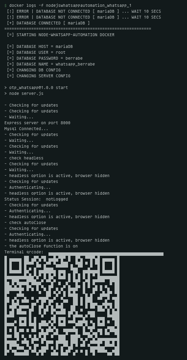
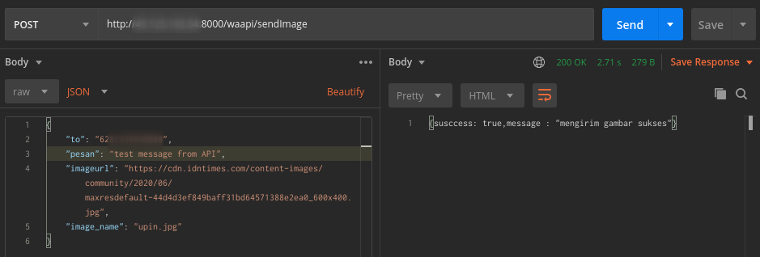
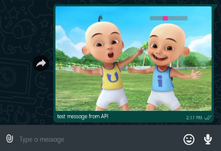

<p align="center">
  
</p>

<br/><br/>

### 1 - RUNNING THIS APP?
---
because it is docker based, make sure you have installed **docker** and **docker-compose**.
and the rest, please follow the steps below.


**1 - Clone this repo**
```sh
> git clone https://github.com/berrabe/nodejs-whatsapp-automation.git
> cd nodejs-whatsapp-automation
```


**2 - Config**

a little configuration you have to do, all these values are default, change according to your needs. replace it in a file called **docker-compose.yml**

```sh
# this is default config for whatsapp-bot container
- DATABASE_HOST=mariaDB
- DATABASE_USER=root
- DATABASE_PASSWORD=berrabe
- DATABASE_NAME=whatsapp_berrabe
- SERVER_URL=localhost
- SERVER_PORT=8000

# this is default config for whatsapp-db container
- MYSQL_ROOT_PASSWORD=berrabe
- WHATSAPP_DB_NAME=whatsapp_berrabe
```

**3 - Run**

and it's time to run this application
```sh
# run the stack
> docker-compose up -d

# to get a qr code in the terminal, you have to run this command, then scan the qr code in the whatsapp smartphone app
> docker logs -f nodejswhatsappautomation_whatsapp_1
```

<br/><br/>


### 2 - BUILD YOUR OWN APP
---
if you want to create your own image, follow the steps below

**1 - NODE API**

You can change the source code of this node js application, like maybe adjust the api needed etc ... what you need to change, is the source code in the `node-wa-api/source/` folder ... if it's finished run this command

```sh
> cd node-wa-api
> ./run.sh
```

**2 - NODE DB**

You can change and create your own database that is used in this application in `the node-wa-db/` folder ... if it's finished run this command

```sh
> cd node-wa-db
> ./run.sh
```


<br/><br/>


### 3 - SOME POC
---
<p align="center">
  
</p>

<p align="center">
  
</p>

<p align="center">
  
</p>

